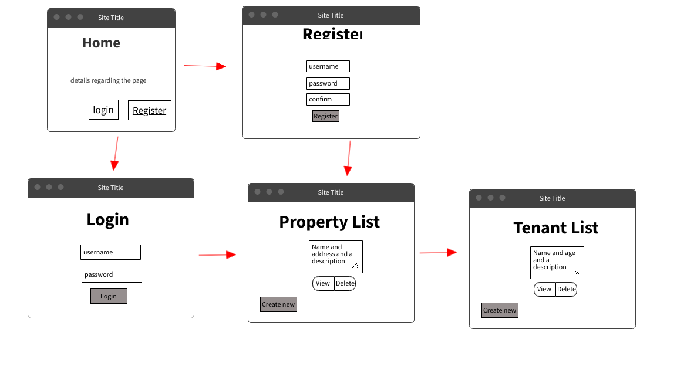

## Rent-A-Prop!

Rent-A-Prop is a full stack MERN application that was created for anyone who owns rental properties and wants to keep track of it's tenants along with more features to be added like income tracker and more specific details about the rental properites and tenants. Although this project is still in early development, expanding and elaborating on this project will be happening very soon.

<!-- PROJECT LOGO -->
<br />
<div align="center" id="top">
    
</div>

## User Stories

- Every user can create both Rental properties AND tenants that live ONLY in that property
- User is able to make a secure account and login in with it
- Users can delete along with edit their rental properties / tenants if they have to with no problems

### PLANNING >>>

Wireframe / Planning


### >>> NOW

List page of rental properties!


<!-- Proud Code -->

## Proud Code
This Code snippet shows how my navbar switches between nav items depending on the url the user is currently in. This might not be the craziest piece of code but I am still proud of it!

```
   return (
    <>
      {
                            (path === '/login') ? (
                                <>
                                    <Nav className="me-auto">
                                        <Nav.Link href="/">Home</Nav.Link>
                                        <Nav.Link href="/about">About</Nav.Link>
                                    </Nav>
                                    <Nav className="ms-auto">
                                        <Nav.Link eventKey={2} href="/register">Register</Nav.Link>
                                    </Nav>
                                </>
                            ) : (path === '/register') ? (
                                <>
                                    <Nav className="me-auto">
                                        <Nav.Link href="/">Home</Nav.Link>
                                    </Nav>
                                    <Nav className="ms-auto">
                                        <Nav.Link href="/login">Login</Nav.Link>
                                    </Nav>
                                </>
                            ) : (path === '/' || path === '/about') ? (
                                <>
                                    <Nav className="me-auto">
                                        <Nav.Link href="/">Home</Nav.Link>
                                    </Nav>
                                    <Nav className="ms-auto">
                                        <Nav.Link href="/login">Login</Nav.Link>
                                        <Nav.Link eventKey={2} href="/register">Register</Nav.Link>
                                    </Nav>
                                </>
                            ) : (
                                <>
                                    <Nav className="me-auto">
                                        <Nav.Link href={`/${userId}/renta/`}>View your Properties!</Nav.Link>
                                        <Nav.Link href={`/${userId}/renta/new`}>Add a Property!</Nav.Link>
                                    </Nav>
                                    <Nav>
                                        <Nav.Link eventKey={2} href="/login">Logout</Nav.Link>
                                    </Nav>
                                </>
                            )
                        }
    </>
```
<p align="right">(<a href="#top">back to top</a>)</p>

<!-- ROADMAP -->

## OLYMPIC HURDLES

- Auth was some what of a challenge in this project but we got it done and have a good understanding of it!
- Displaying varibales for my second model because it had to reach deeper into the model for it
- Image upload which I did not incoporate in this repo but am still working on!

<p align="right">(<a href="#top">back to top</a>)</p>

<!-- Technologies Used -->

### Technologies Used:

This is a project utilizes the following technologies:

- MongoDB
- Mongoose
- Express
- React.js
- React Bootstrap
- Dotenv
- jsonwebtoken
- passport
- passport-jwt
- Surge
- Heroku

<p align="right">(<a href="#top">back to top</a>)</p>

#### How to install packages

In your terminal, run:

```
git clone https://github.com/Froy-y/rent-a-prop-FE.git
cd rent-a-prop-FE
npm i
```

Verify these have been installed by checking your package.json file.

- react-bootstrap
- react-router-dom

And do the same for these dependencies in your backend folder:

- bcrypt
- cors
- dotenv
- express
- jsonwebtoken
- method-override
- mongoose
- passport
- passport-jwt

<p align="right">(<a href="#top">back to top</a>)</p>

<!-- CONTACT -->

## Contact

Feel free to reach out at any time!

- [LinkedIn](https://www.https://www.linkedin.com/in/froy-/)
- [GitHub](https://https://github.com/Froy-y)

<p align="right">(<a href="#top">back to top</a>)</p>

<p align="right">(<a href="#top">back to top</a>)</p>
